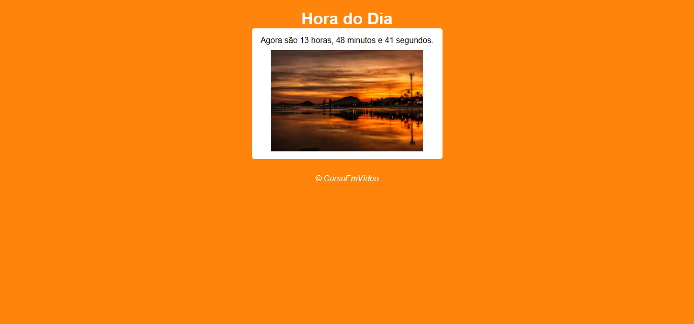

# Relógio

## 🛠 Tecnologias

- HTML
- CSS
- JavaScript
- Git e Github

## 💻 Projeto

Relógio criado como exercício do CureoEmVídeo

## :memo: Licença

Esse projeto está sob a licença MIT.

## ❤️ Contato

@arielrodrigues460